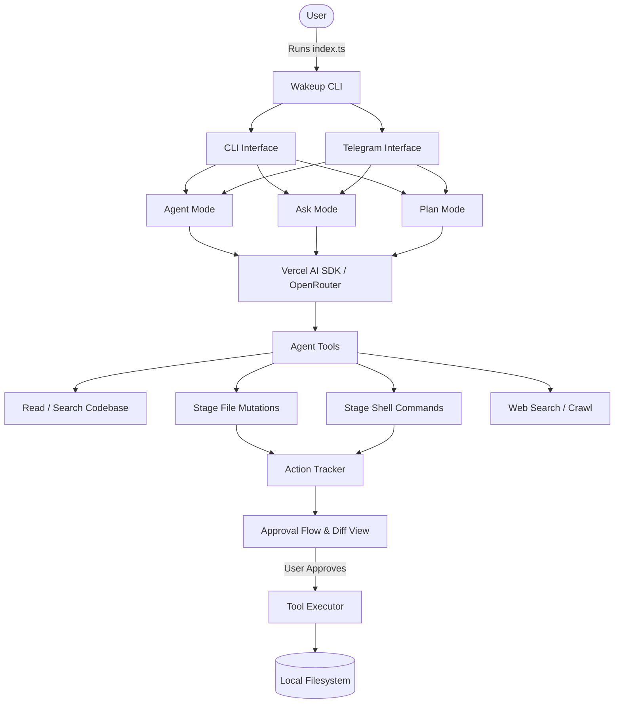

# NeuroClaw

NeuroClaw is an advanced, autonomous AI coding assistant and repository agent. Powered by the **Vercel AI SDK** and **OpenRouter**, it explores, plans, and mutates local codebases with a robust human-in-the-loop approval system. It features both a rich Terminal User Interface (TUI) and a remote Telegram bot interface.

## 🚀 Features

* **Dual Interfaces:** Interact with the agent locally via a beautiful TUI built with `@clack/prompts`, or manage your codebase remotely via the built-in Telegram Bot.
* **Agent Mode:** Assign complex coding tasks. The AI can read, search, and analyze your codebase, then stage file creations, modifications, deletions, and queue shell commands.
* **Plan Mode:** Define a high-level goal, and the AI will research and draft a step-by-step execution plan. You can select exactly which steps to execute.
* **Ask Mode:** A read-only mode for querying your codebase. It can analyze directory structures, read file contents, and summarize logic.
* **Human-in-the-loop Security:** All file mutations and shell executions are staged using a secure `ActionTracker`. You receive a complete diff view to review, accept, or reject changes before they ever touch your filesystem.
* **Web Integration:** Ask and Plan modes utilize Firecrawl to search the web, scrape URLs, and fetch up-to-date documentation to inform coding decisions.

## 🏗 Architecture



## 🛠 Prerequisites

* **[Bun](https://bun.sh/)**: A fast all-in-one JavaScript runtime.
* **OpenRouter API Key**: Required for the underlying LLM operations.
* **Firecrawl API Key** *(Optional)*: Unlocks `web_search` and `fetch_url` tools for web scraping.
* **Telegram Credentials** *(Optional)*: Required if you want to run the Telegram Bot interface.

## 📦 Installation

1. Clone the repository:
   ```bash
   git clone https://github.com/parthkhiriya/neuro-claw.git
   cd neuro-claw
   ```

2. Install dependencies using Bun:
   ```bash
   bun install
   ```

3. Create a `.env` file in the root directory and configure your API keys:
   ```env
   # Required
   OPENROUTER_API_KEY=your_openrouter_key
   OPENROUTER_DEFAULT_MODEL=anthropic/claude-3.5-sonnet

   # Optional: For Web Tools
   FIRECRAWL_API_KEY=your_firecrawl_key

   # Optional: For Telegram Mode
   TELEGRAM_BOT_TOKEN=your_bot_token
   TELEGRAM_OWNER_ID=your_telegram_user_id
   ```

## 💻 Usage

Run the entrypoint script to launch the main wakeup menu:

```bash
bun run ./index.ts wakeup
```

From the wakeup menu, you can select between the **CLI** or **Telegram** interfaces.

### CLI Mode
Navigating into the CLI provides three distinct sub-modes:
1. **Agent:** Input a task, and the agent will begin staging changes. Once complete, it will prompt you with a diff review before applying anything to the disk.
2. **Plan:** Input a larger goal. The agent will read your codebase, search the web, and output a multi-step checklist that you can interactively toggle.
3. **Ask:** Ask read-only questions about the local codebase.

### Telegram Mode
Select `Telegram` to boot up the bot server. Ensure you have messaged your bot first. You can control the agent remotely using commands:
* `/ask <question>` — Ask a read-only question about the codebase.
* `/agent <task>` — Instruct the agent to execute a task and stage modifications.
* `/plan <goal>` — Generate a checklist plan with inline Telegram buttons to toggle execution steps.

All staged changes made via the Telegram bot will send inline button callbacks to your chat, allowing you to review the diffs and approve or reject the changes securely from your phone.

## 🛡 Security & Permissions
NeuroClaw limits execution strictly to the current working directory. The `ToolExecutor` is sandboxed to prevent the agent from accessing or modifying paths outside the workspace root, effectively preventing path traversal vulnerabilities. System directories and environments like `node_modules` and `.git` are protected by default.